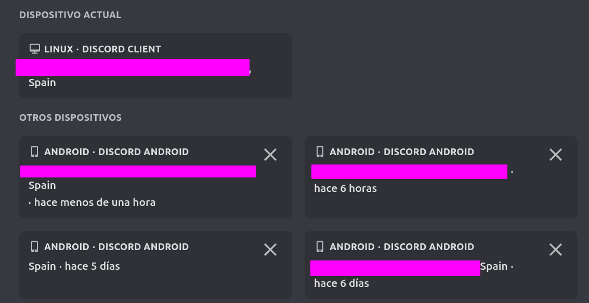

# Discord CSS tweaks

## Better sessions

```css
@import url('https://martinz64.github.io/remove-nitro/better_sessions.css');
```

## Remove nitro

Make a pull request if i forget something pls🙏

Add this to your theme file or quickcss file:
```css
@import url('https://martinz64.github.io/remove-nitro/main.css');
@import url('https://martinz64.github.io/remove-nitro/remove_boosting.css');
@import url('https://martinz64.github.io/remove-nitro/remove_profile_colors.css');
@import url('https://martinz64.github.io/remove-nitro/remove_emoji_upsell.css');
@import url('https://martinz64.github.io/remove-nitro/remove_avatar_decoration.css');
@import url('https://martinz64.github.io/remove-nitro/remove_super_reactions.css');
```


